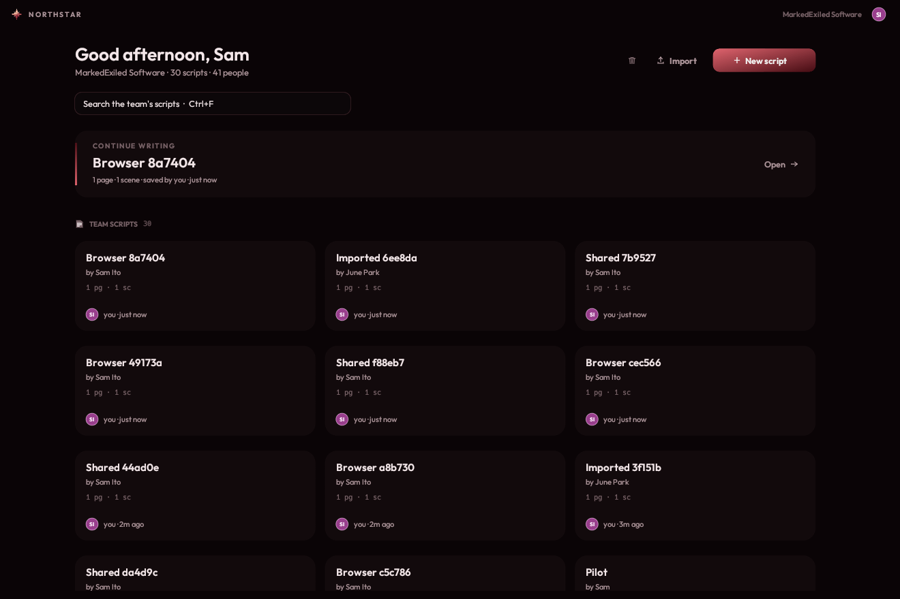
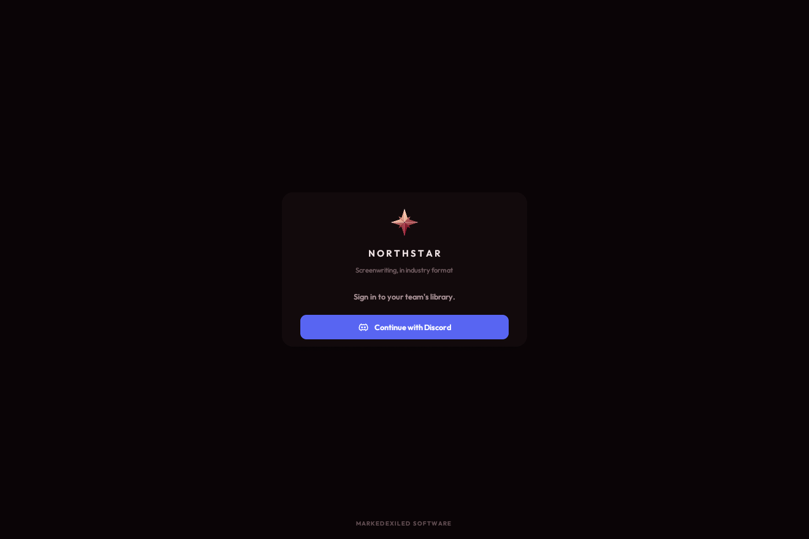
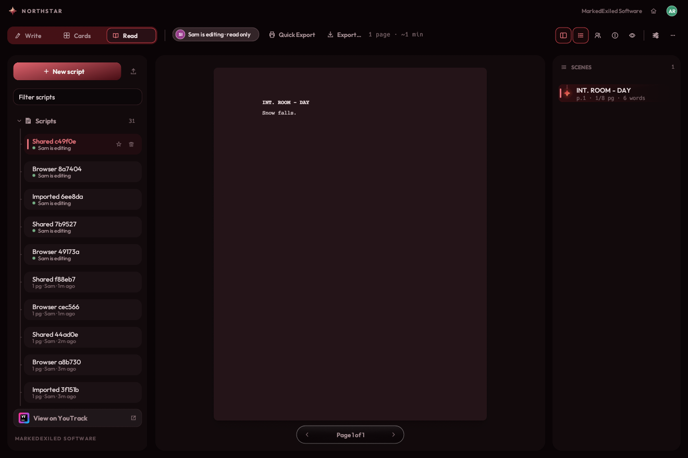
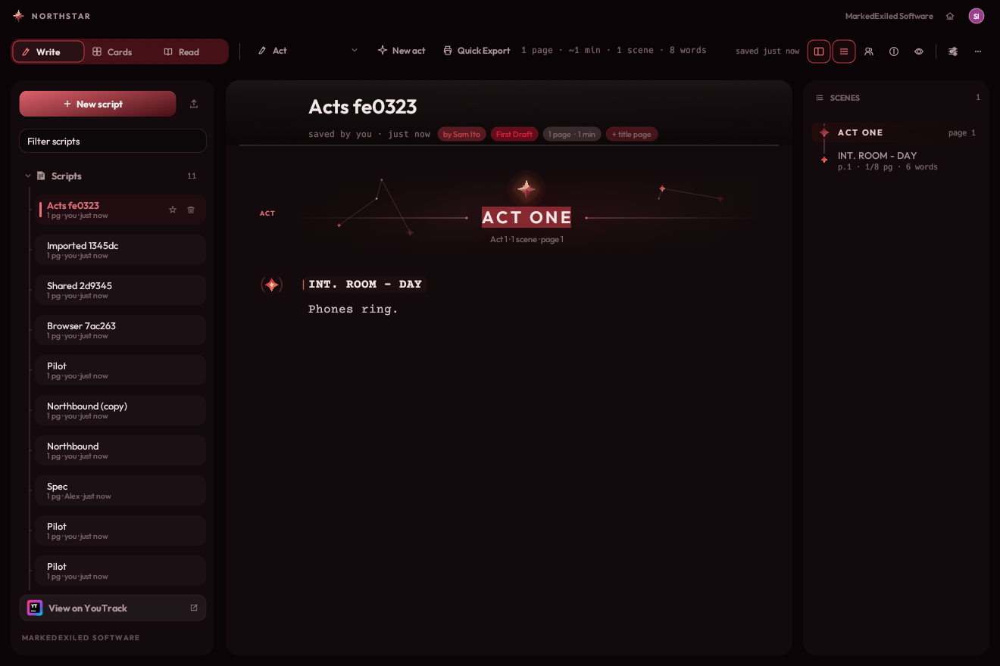
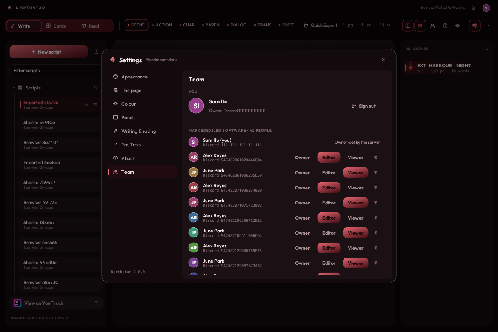

# Northstar Web

The team edition of [Northstar](https://github.com/exiledddev/northstar), the
screenwriting studio by MarkedExiled Software. Your whole team uses it in a
browser, on one shared library.



- **The same app.** The browser runs Northstar's own Rust code, compiled to
  WebAssembly. The editor, Cards, Reading mode, every theme and the PDF export
  are exactly the desktop app's.
- **Discord accounts.** Everyone signs in with Discord. Only people on the
  team's list get in. Owners add teammates by Discord ID and set them as owner,
  editor or viewer.
- **A script picker when you arrive.** Every script appears as a card with who
  saved it last and who is in it right now. Starred scripts come first, and
  your last script is one click away.
- **Who wrote what.**
  - Every save is credited to its writer.
  - History shows each stretch of work: who, when, and how many words.
  - When someone new picks up a script, the version before them is kept as a
    snapshot.
- **Nobody overwrites anybody.** One person edits a script at a time; everyone
  else reads along live, with a chip saying who is editing. When they finish,
  the next person can take over.
- **Nothing typed is lost.** Changes stay in your browser until the server has
  them, and a crashed tab offers them back. A save the server refuses is kept
  as a snapshot before anything else happens. Deleted scripts wait 30 days in
  Recently deleted.
- **Acts.** *New act* in the Write ribbon (or Ctrl+Shift+Enter) starts an act
  where your cursor is (on the next line, or with the scene if the cursor is in
  its heading), named ACT ONE, ACT TWO… in order; rename it to
  TEASER or COLD OPEN by typing over it. In the script an act is a wide
  divider with a constellation of its own. In print every act starts a new
  page with its title centred, bold and underlined, and ends with a centred
  END OF ACT ONE. The navigator and Cards group scenes by act.
- **Character colours you choose.** In Settings → Colour, character colours
  are *Random* (dealt from the wheel, as before; Shuffle deals again) or
  *Custom*. Click a character's colour, in the Cast panel or the Colour tab,
  to choose theirs; they keep it everywhere, in every theme and in the PDF.
  Chosen colours are kept in the script, so the whole team sees the same
  ones. *Use random* gives a colour back to chance.
- **Your own shortcuts.** Settings → Keyboard lists every shortcut. Click one
  and press the keys you want instead. Each person's shortcuts are their own:
  they are kept with that person's account, so they follow them to any
  browser they sign in on. *Reset all to default* puts back the usual ones.
- **Free to run.** One Cloudflare Worker and a D1 database, both on
  Cloudflare's free plan (numbers in [PLAN.md](PLAN.md)).

Your own Northstar library on your computer (`~/.local/share/northstar`) is
never touched by any of this. The web app cannot see it. Moving scripts to the
team uploads copies (see below).

| Signing in | Someone else is editing |
|---|---|
|  |  |



## How it fits together

```
browser ── Northstar (wasm) ──► Cloudflare Worker (Rust) ──► D1 (SQLite)
                                 ├─ the app's files (served free, no Worker run)
                                 ├─ /auth/*  Discord sign-in, sessions
                                 └─ /api/*   scripts, leases, history, team
```

| Folder | What it is |
|---|---|
| `web/` | The browser app: the `northstar` crate (pinned to a commit) plus a `Store` that talks to the server, the sign-in screen, and the page around it |
| `server/` | The Worker: Discord OAuth2, the API, the D1 schema (`migrations/`) |
| `PLAN.md` | The design: why Cloudflare, the free-tier numbers, what comes next |

## Set it up (once, about 20 minutes)

You need a free Cloudflare account and a Discord account. These steps are for
Debian, Ubuntu and Pop!_OS, and are done from your own computer: Cloudflare's
"Import a repository" builder cannot build the Rust app.

### 1. Tools

```sh
# Rust, if you don't have it
curl --proto '=https' --tlsv1.2 -sSf https://sh.rustup.rs | sh
rustup target add wasm32-unknown-unknown

# Node.js 20 or newer, for Cloudflare's wrangler tool
sudo apt install nodejs npm        # or from nodejs.org if your release has an older one

# the wasm-bindgen CLI at the exact version web/Cargo.lock names
# (web/build.sh tells you the version if it is wrong)
cargo install wasm-bindgen-cli --version 0.2.129

# optional: makes the download smaller
sudo apt install binaryen
```

### 2. Build and deploy

```sh
web/build.sh                  # builds the app into web/dist
cd server
npm install
npx wrangler login            # opens the browser once
npm run deploy                # builds the Worker and publishes both
npm run migrate:remote        # creates the tables
```

The first `npm run deploy` also creates the D1 database and writes its
`database_id` into `server/wrangler.toml`. Commit that line, so later deploys
use the same database. It prints the address of your app:
`https://northstar.<your-subdomain>.workers.dev`. The app answers there now,
but nobody can sign in until steps 3 and 4 are done.

If the deploy stops because there is no database (an older wrangler can't
create one), run `npx wrangler d1 create northstar`, add the `database_id` it
prints to the `[[d1_databases]]` section of `server/wrangler.toml`, and run
`npm run deploy` again.

### 3. A Discord application, for signing in

1. Go to <https://discord.com/developers/applications> and choose **New
   Application**. Call it "Northstar".
2. Open **OAuth2**. Copy the **Client ID**. Choose **Reset Secret** and copy
   the **Client Secret**; keep it private.
3. Under **Redirects**, add:
   - `https://northstar.<your-subdomain>.workers.dev/auth/discord/callback`,
     the address step 2 printed. If you use a custom domain, use that
     instead.
   - `http://localhost:8787/auth/discord/callback`, for trying it locally.
4. Your own Discord user ID: in Discord, open **Settings → Advanced**, turn on
   **Developer Mode**, then right-click your name and choose **Copy User ID**.

### 4. Three secrets

Still in `server/`:

```sh
npx wrangler secret put OWNER_DISCORD_IDS       # your Discord user ID (several: comma separated)
npx wrangler secret put DISCORD_CLIENT_ID       # the Client ID from step 3
npx wrangler secret put DISCORD_CLIENT_SECRET   # the Client Secret from step 3
```

Each one asks for its value and takes effect at once; there is nothing to
redeploy. They live in Cloudflare, not in the repository, and no later deploy
changes them. Owners listed in `OWNER_DISCORD_IDS` can always sign in.
`TEAM_NAME`, what the app calls your team, is in `server/wrangler.toml`.

Open the address from step 2 and sign in with Discord. You are the owner.

### 5. Add your team

In the app, open your picture (top right) → **The team** → **Add someone**.
Paste their Discord user ID, pick **Editor** or **Viewer**, and send them the
address. Anyone not on the list who tries to sign in sees their own Discord ID
and is asked to send it to you.



## Moving scripts from the desktop app

On the web, use **Import** (on Home, or in the library) and select the `.md`
files in `~/.local/share/northstar/scripts`. You can pick several at once.
The browser reads copies: your local files stay exactly as they were. Fountain
(`.fountain`) and Final Draft (`.fdx`) files import the same way.

## Updating

- **The app.** When Northstar itself changes, point `rev` in `web/Cargo.toml`
  at the new commit of `exiledddev/northstar`, then `web/build.sh` and
  `npm run deploy` again.
- **The server.** If a change adds files to `server/migrations/`, run
  `npm run migrate:remote` before deploying.
- Deploying never touches the secrets from step 4, or the scripts in the
  database.

### Updating from the first version

The first version kept your database id and Discord IDs in
`server/wrangler.toml`. Now the database id is the only one of them kept
there, and the Discord IDs are secrets. If you deployed that first version,
update like this, in this order. Your team's scripts stay where they are.

1. **Note your settings.** Open `server/wrangler.toml` and copy your
   `database_id`, `OWNER_DISCORD_IDS`, `DISCORD_CLIENT_ID`, and `TEAM_NAME`
   if you changed it. (`npx wrangler d1 list` shows the database id again if
   you ever lose it.)
2. **Get the new code.** Your edits to `wrangler.toml` would block the pull,
   so set them aside first:

   ```sh
   git stash
   git checkout main
   git pull
   ```

   You won't need the stash back: the values are in your notes from step 1,
   and `git stash drop` clears it once the update works.

   If you had committed those edits instead, pull with
   `git pull --no-rebase`. It stops on a conflict in `server/wrangler.toml`:
   take the new file with `git checkout --theirs server/wrangler.toml`, do
   step 3, then `git add server/wrangler.toml` and `git commit`.
3. **Put your database back.** In `server/wrangler.toml`, under
   `[[d1_databases]]`, add `database_id = "<your id>"` (and your
   `TEAM_NAME`, if you had changed it). Commit it, so the next pull doesn't
   clash; the id is not a secret. **Do not skip this:** without the id, the
   next deploy creates a new, empty database, and the team's scripts would
   seem to be gone.
4. **Build and deploy:**

   ```sh
   web/build.sh
   cd server
   npm install
   npm run deploy
   ```

   This deploy removes the two old plain variables from the Worker. There are
   no new tables, so no migration is needed.
5. **Add the two secrets straight away:**

   ```sh
   npx wrangler secret put OWNER_DISCORD_IDS
   npx wrangler secret put DISCORD_CLIENT_ID
   ```

   `DISCORD_CLIENT_SECRET` is a secret already; leave it. Until this step is
   done, owners who are only in `OWNER_DISCORD_IDS` may be signed out. They
   can sign in again once it is done.
6. **Load the new app.** Reload the site with Ctrl+Shift+R. **New act** is in
   the Write toolbar, and Settings has a **Keyboard** tab.

## Working on it locally

```sh
cd server
cp .dev.vars.example .dev.vars   # DEV_LOGIN=1; owner 111111111111111111
npm install
npm run migrate:local
npm run dev                      # http://127.0.0.1:8787

# in another terminal
NORTHSTAR=../northstar web/build.sh    # or plain web/build.sh for the pinned commit
```

Sign in without Discord at `http://127.0.0.1:8787/auth/dev?id=111111111111111111&name=Sam`.
This development sign-in only works on your own machine with `DEV_LOGIN=1`,
which is never deployed. The team list still decides who gets in.

### Tests

```sh
cd server && cargo test            # the server's decisions, natively
cd server && npm test              # the whole API, against `npm run dev`
cd web && npm install && npm test  # the real app in Chromium (Playwright), against `npm run dev`
```

## Keeping it safe

- Everything except the app's own files needs a signed-in session, and every
  change must come from the app's own pages.
- Sessions last a month. Only a hash of each session token is stored.
  Removing someone from the team signs them out everywhere at once.
- The Content Security Policy (`web/static/_headers`) allows no inline
  scripts and no third-party connections.
- Backups: D1 can restore any moment from the last 7 days (Time Travel, free).
  For a copy of your own, run
  `npx wrangler d1 export northstar --remote --output northstar-backup.sql`.

## Limits worth knowing

- **Browsers.** Built for desktop browsers with WebGL 2 (Chrome, Edge,
  Firefox, Safari); the automated tests run in Chromium. Phones and tablets
  are not supported yet.
- **Keyboard shortcuts.** Browsers keep Ctrl+N and Ctrl+1–7 for themselves.
  Use Ctrl+Alt+N for a new script and Alt+1–7 for elements. Ctrl+Shift+Enter
  starts an act. Any of them can be changed in Settings → Keyboard, except to
  a chord the browser keeps.
- **The file picker in headless Chromium.** The automated import test clicks
  Import again if headless Chromium shows no file picker for the first click.
  The app opens it within the click every time.
- **One editor per script, for now.** Real-time co-writing is the next phase
  (see [PLAN.md](PLAN.md)).

MarkedExiled Software.
